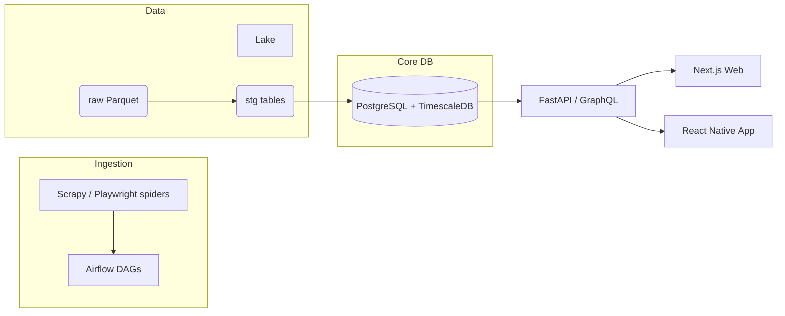

# Inequality App

_A cross‑platform web, iOS & Android application that reveals how much passive income public figures earn each year and what a 1 % wealth tax above £2 million would cost them._

## Table of Contents
1. [Features](#features)
2. [Architecture](#architecture)
3. [Tech Stack](#tech-stack)
4. [Getting Started](#getting-started)
5. [Directory Layout](#directory-layout)
6. [Environment Variables](#environment-variables)
7. [Development Workflows](#development-workflows)
8. [Testing](#testing)
9. [Deployment](#deployment)
10. [Contributing](#contributing)
11. [License](#license)

## Features
* Scrapes official & reputable sources for:
  * UK MPs’ Register of Members’ Financial Interests  
  * Company filings (Companies House, SEC EDGAR)  
  * Forbes real‑time billionaire valuations  
  * Land Registry & other public datasets
* Normalises raw data into a Postgres + TimescaleDB core schema
* GraphQL API for aggregated metrics such as yearly passive income & simulated wealth tax
* Web **(Next.js 15)** and mobile **(React Native 0.75/Expo EAS)** clients
* Automated DAGs (Airflow) & CI/CD with GitHub Actions

## Architecture


## Tech Stack
| Layer       | Technology |
|-------------|------------|
| Scraping    | Python 3.12, Scrapy, Playwright |
| Orchestration | Airflow 2.9 (k8s executor) |
| Storage     | PostgreSQL 15, TimescaleDB 2.11, S3‑compatible object store |
| Backend API | FastAPI 0.111 + Strawberry GraphQL |
| Front‑end (web) | Next.js 15, React 18, tRPC |
| Front‑end (mobile) | React Native 0.75 + Expo EAS |
| Containers  | Docker + Docker Compose |
| CI/CD       | GitHub Actions + Railway / Fly.io |

## Getting Started

### Prerequisites
* Docker 20.10+ and Docker Compose v2
* `make`, `git`, Node 18 LTS

### Quick Start
```bash
git clone https://github.com/your-org/inequality-app.git
cd inequality-app
cp .env.example .env          # add your secrets
make dev                      # boots full stack (db, api, web, airflow)
```

Once the stack is healthy:
* Web UI → http://localhost:3000  
* GraphQL Playground → http://localhost:8000/graphql  
* Airflow UI → http://localhost:8080

## Directory Layout
```text
.
├── services/
│   ├── ingestion/          # Scrapy spiders & Playwright collectors
│   ├── transform/          # dbt or SQL transform scripts
│   └── api/                # FastAPI app
├── clients/
│   ├── web/                # Next.js site
│   └── mobile/             # React Native app
├── dags/                   # Airflow DAGs
├── sql/                    # schema & migrations (Alembic)
├── .cursor/                # Cursor AI rules (see below)
└── docker-compose.yml
```

## Environment Variables
| Name | Example | Description |
|------|---------|-------------|
| `DATABASE_URL` | `postgresql://user:pass@db:5432/ineq` | TimescaleDB connection |
| `FORBES_API_KEY` | `sk_live_…` | Optional—licensed Forbes snapshot |
| `PLAYWRIGHT_BROWSERS_PATH` | `/ms-playwright` | Re‑used container cache |

An up‑to‑date list lives in **`/.env.example`**.

## Development Workflows
* **Python** – Black + Ruff + MyPy (`make lint`)  
* **TypeScript** – ESLint + Prettier  
* **Tests** – Pytest / React Testing Library (`make test`)  
* **Migrations** – `alembic revision --autogenerate -m "…" && alembic upgrade head`
* **Conventional Commits** – `feat:`, `fix:`, `chore:` …

## Testing
```bash
make unit          # fast, no network
make integration   # spins up db & web containers
make e2e           # Playwright browser tests
```

## Deployment
1. Push to `main` triggers CI  
2. Images built & published to GHCR  
3. Staging deployment via Helm to k8s / Fly.io  

## Contributing
We welcome pull requests! Please read `CONTRIBUTING.md` for the workflow.

## License
MIT © 2025 Inequality App Ltd
